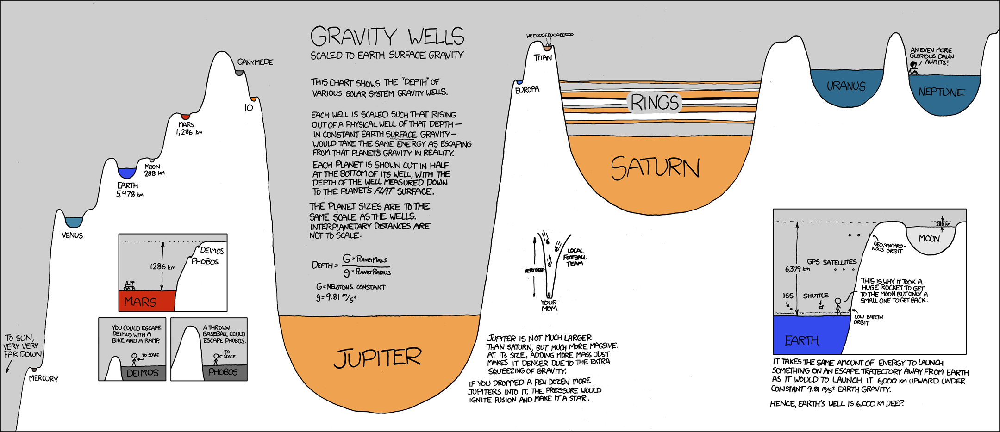
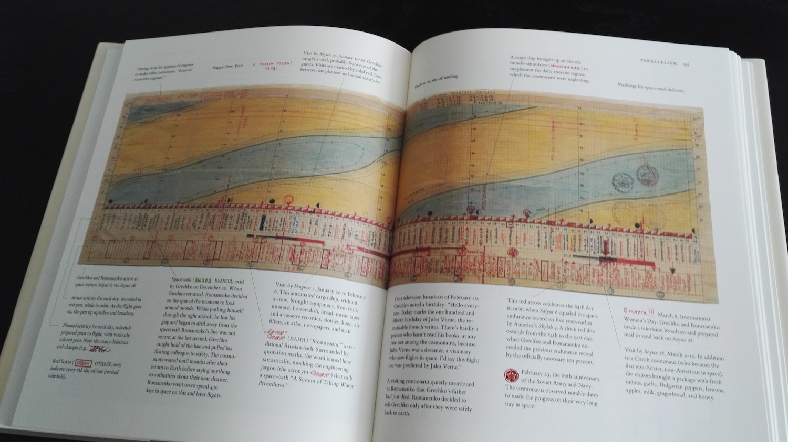
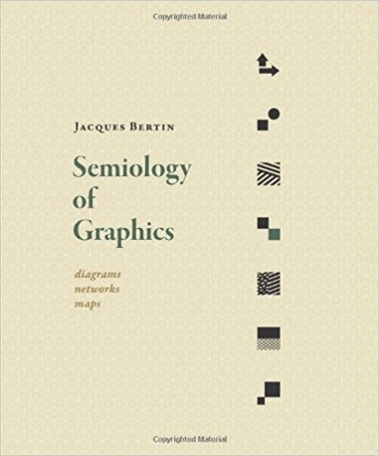
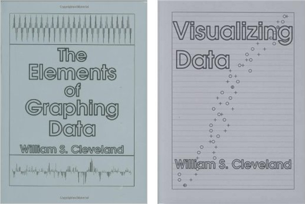
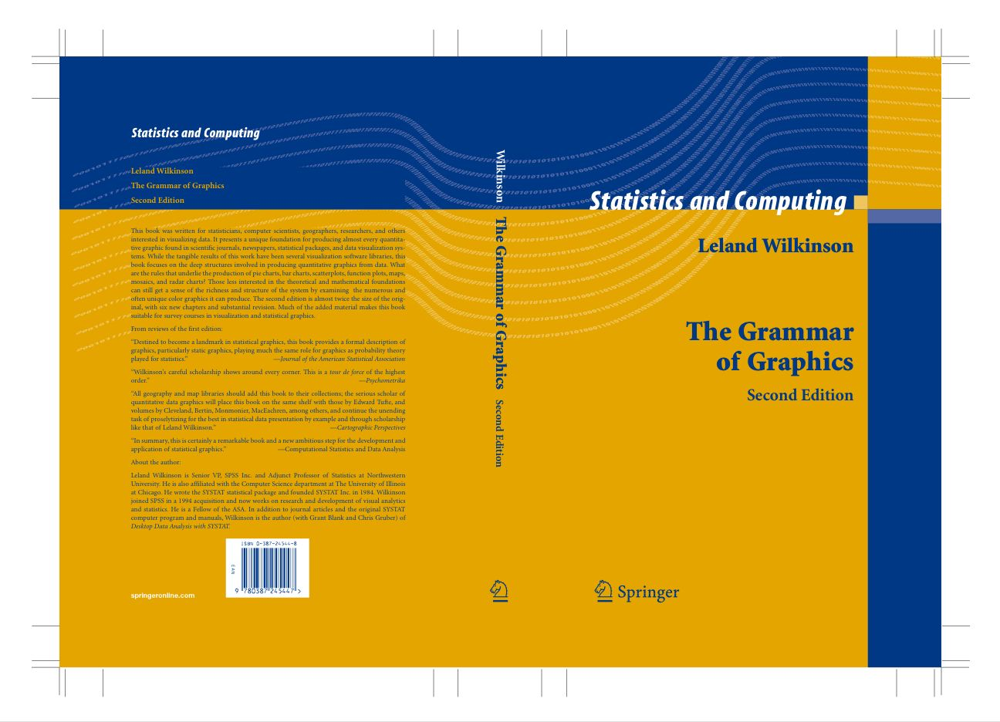

```{r setup, include=FALSE}
knitr::opts_chunk$set(eval = TRUE)
knitr::opts_chunk$set(fig.path = "../assets/graphics01/")
knitr::opts_chunk$set(fig.height = 5)
knitr::opts_chunk$set(fig.width = 8.5)
knitr::opts_chunk$set(out.width = "100%")
knitr::opts_chunk$set(dpi = 300)
```

```{r, message = FALSE}
library(readr)
library(ggplot2)
library(dplyr)
library(viridis)
```

## A Brief History of Statistical Graphics

### Early History

When most people think about statistical graphics, they
assume I am either talking about the purely aesthetic
properties of creating visual representations of data or
a list of specific types of plots (i.e., histograms,
box plots, bar plots). The history of the latter case,
essentially akin to graphic design in general, dates
can be traced back to as early as the 6th century B.C.E.
with the earliest known maps:


The golden age of beautiful, hand-drawn graphics more
closely resembling those of today was centred around
19th Century France. Charles Minard's (1781-1870)
visualization of Napoleon's defeat in Russia is perhaps
the most well-known example of work from this period:


Personally, I am partial to the work of André-Michel Guerry
(1802 - 1866), who made amazingly modern visual arguments
from French census data.


In the 20th Century, this tradition has been carried on
with a plethora of hand designed infographics scattered
across the web and in print media such as this example
on Randall Munroe's *xkcd* web-comic:



Edward Tufte is likely the most well-known modern figure
in data-based graphical design. He has written a number
of influential books such as *The Visual Display of
Quantitative Information* (1983), *Envisioning Information*
(1990) and *Visual Explanations: Images and Quantities,
Evidence and Narrative* (1997).



I have all of his (stunningly beautiful) books in my office
if you would ever like to thumb through them.

### Theorizing Graphics

Making visually pleasing graphics is important. Our focus
today, however, is on understanding and theorizing exactly
how graphics encode knowledge about data. The history of
this begins, at least to us, with the work of Jacques Bertin
(1918-2010), a cartographer and philosopher by training.
In his 1967 work *Semiologie Graphique* he argued that:

> Graphic representation constitutes one of the basic sign-systems
> conceived by the human mind for the purposes of storing, understanding,
> and communicating essential information. As a "language" for the eye,
> graphics benefits from the ubiquitous properties of visual perception.
> As a monosemic system, it forms the rational part of the world of images.

To the best of my knowledge, this is the earliest explicit
description of graphics as a form of knowledge and evidence.
Bertin's work was republished in English in 1983 as
*Semiology of graphics: diagrams, networks, maps*:



With the translation, Bertin quickly became known by scholars
of statistical graphics. Bill Cleveland, in *Visualizing Data*
(1985), built on Bertin’s work by theorizing a distinction between
graphing, the process of visualizing  raw data, and fitting,
the process of visualizing transformed data and statistical models.



His parallel text, *The Elements of Graphing* (1993),
describes an actual system to implement many of his ideas.

In *The Grammar of Graphics* (1999), Wilkinson extended
Cleveland’s theory by drawing a distinction between the
mathematical abstraction of a graph and the physical
manifestation of a rendered graphic. He then set out
to describe the fundamental units that comprised a
visualization.



Wilkinson constructed a formal language for describing
statistical visualizations by separating out the
mathematical specification of a graphics system from
the aesthetic details of its assembly and display.
Wilkinson named each component of the visualization,
moving from the original data to the output, a layer
in his formal Grammar of Graphics system.

Examples of layers include:

- picking the scale of the plot
- choosing the size of points
- computing summary statistics

Wilkinson’s formal language explicates what assumptions
are being made, where these assumptions are being
made, and how the original data has been modified to
create the output.

Finally, Hadley Wickham implemented and described a
graphical system built on the ideas of Wilkinson in
*ggplot2: Elegant Graphics for Data Analysis* (2009).
His object-oriented system, the **ggplot2** R library,
constructs rules for fitting together a small number
of classes and relationships between them to create an
"almost unlimited world of graphical forms". For Wickham's
interpretation, see the (very readable and open access) paper
["The Layered Grammar of Graphics"](http://vita.had.co.nz/papers/layered-grammar.pdf).
It is the usage of the **gplot2** package that we now turn to.

## Hans Rosling

Hans Rosling's 200 Countries, 200 Years, 4 Minutes:

- [https://www.youtube.com/watch?v=jbkSRLYSojo](https://www.youtube.com/watch?v=jbkSRLYSojo)

I have shown this to nearly all of my statistics courses, and while
a bit dated it is still the best representation of what data visualization is
all about.

## What is 'data'?

In this workshop, we will explicitly work with data in a tabular format. It is
important in understanding the grammar of graphics to have some basic
terminology about tabular data.

Tables of data have **observations** stored in rows and
**variables** stored in columns. The individual elements are
called **values**. So, each row represents a
particular object in our dataset and each column represents
some feature of the objects.


Let's look at a dataset of Roman Catholic dioceses in the United States:

```{r, message = FALSE}
library(historydata)

catholic_dioceses <- as_data_frame(catholic_dioceses)
catholic_dioceses
```

The observations here are *dioceses* and the variables are: `diocese`,
`rite`, `lat`, `long`, `event`, and  date`. Each variable
measures something about a given observation. What exactly
constitutes a row of the data is called a **unit of analysis**.
Keeping in mind what the unit of analysis is will be very
important as we think about how data is being used.

## Graphics in R: ggplot2

### Example with Hans Roslin's data

To illustrate how to actually use the grammar of graphcs in R points, let's
look at a subset of the data that Hans Roslin used in the video. It contains
just a single year of the data (2007).

```{r, message=FALSE}
gapminder_2007 <- read_csv("https://statsmaths.github.io/stat_data/gapminder_2007.csv")
gapminder_2007
```

Here is a plot similar to the one that Roslin used without all of the fancy
colors and moving elements.

```{r}
ggplot(gapminder_2007, aes(gdp_per_cap, life_exp)) +
  geom_point()
```

Here there are four specific elements that we had to choose to create the plot:

1. selecting the dataset name to use, `gapminder_2007`
2. selecting the variable `gdp_per_cap` to appear on the x-axis
3. selecting the variable `life_exp` to appear on the y-axis
4. choosing to represent the dataset with points by using the `geom_point` layer.

The specific syntax of how to put these elements together is just something that
you need to learn and memorize. Note that the plus sign goes at the end of the
first line and the second line is indented by two spaces.

## Layers

The beauty of the grammar of graphics is that we can construct many types of
plots by combining together simple layers. There is another geometry called
`geom_line` that draws a line between data observations instead of points
(note: this does not actually make much sense here, but we will try it just
to illustrate the idea):

```{r}
ggplot(gapminder_2007, aes(gdp_per_cap, life_exp)) +
  geom_line()
```

But let's say we want the points **and** the lines, how does that work? Well, we just
add the two layers together:

```{r}
ggplot(gapminder_2007, aes(gdp_per_cap, life_exp)) +
  geom_line() +
  geom_point()
```

Or, we could add a "best fit line" through the data using the `geom_smooth`
layer with a particular option:

```{r}
ggplot(gapminder_2007, aes(gdp_per_cap, life_exp)) +
  geom_smooth(method = "lm") +
  geom_point()
```

We will cover these types of modeling lines in more detail in the third section of the
course.

## Other geometry types

The `geom_text` is another layer type that puts a label in place of a point. It requires
a new input called the `label` that describes which variable is used for the text. Here we
see it combined with the points layer:

```{r}
ggplot(gapminder_2007, aes(gdp_per_cap, life_exp)) +
  geom_text(aes(label = country))
```

Again, the specific syntax is something you just need to look up or memorize.

We can also have the show a single variable in a plot using a specific type
of geometry. To show the distribution of a categorical variable, use
`geom_bar` to make a bar plot:

```{r}
ggplot(gapminder_2007, aes(continent)) +
  geom_bar()
```

Or, use `geom_hist` to build a histogram of a continuous variable:

```{r}
ggplot(gapminder_2007, aes(gdp_per_cap)) +
  geom_bar()
```

## Data Aesthetics

We discussed how in the first line the variable `gdp_per_cap` is mapped to the x-axis
and `life_exp` is mapped to the y-axis. One powerful feature of the grammar of graphics
is the ability to map variables into other graphical parameters. These are called
"aesthetics" (that is what the `aes()` function stands for) and we already saw one example
last time with the `geom_text` function.

For example, we can change the color of the points to correspond to a variable in the
dataset like this:

```{r}
ggplot(gapminder_2007, aes(gdp_per_cap, life_exp)) +
  geom_point(aes(color = continent))
```

We can also map a continuous variable to color, though the default scale
is not very nice (more on this in a bit).

```{r}
ggplot(gapminder_2007, aes(gdp_per_cap, life_exp)) +
  geom_point(aes(color = log(pop)))
```

We could also change the size of the point to match the population. Note that R
writes the population key in scientific notation (2.5e+08 is the same as 2.5 time
10 to the power of eight).

```{r}
ggplot(gapminder_2007, aes(gdp_per_cap, life_exp)) +
  geom_point(aes(size = pop))
```

Or, finally, we could change both the size and color.

```{r}
ggplot(gapminder_2007, aes(gdp_per_cap, life_exp)) +
  geom_point(aes(size = pop, color = continent))
```

Notice that R takes care of the specific colors and sizes. All we do is indicate which
variables are mapped to a given value.

I rarely do this in practice, but it is also  possible to map a variable to a shape:

```{r}
ggplot(gapminder_2007, aes(gdp_per_cap, life_exp)) +
  geom_point(aes(shape = continent))
```

## Fixed aesthetics

A very powerful feature of the grammar of graphics is the ability to map a variable to
a visual aesthetic such as the x- and y-axes or the color and shape. In some cases,
though, you may just want to change an aesthetic to a fixed value for all points.
This can be done as well by specifying the aesthetic **outside** of the `aes()`
function. For example, here I'll change all of the points to be blue:

```{r}
ggplot(gapminder_2007, aes(gdp_per_cap, life_exp)) +
  geom_point(color = "blue")
```

R won't give an error if I put the same code inside of the aes function. Watch
this:

```{r}
ggplot(gapminder_2007, aes(gdp_per_cap, life_exp)) +
  geom_point(aes(color = "blue"))
```

**What's happening here?!**

You can mix fixed and variable aesthetics in the same plot. For example, here I
use color to represent the continent but make all the points larger.

```{r}
ggplot(gapminder_2007, aes(gdp_per_cap, life_exp)) +
  geom_point(aes(color = continent), size = 3)
```

Note that the `aes()` part **must** go first. Just another rule you need to remember.
