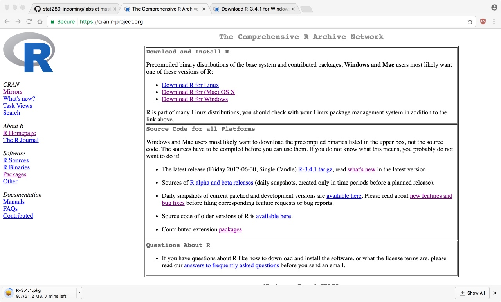
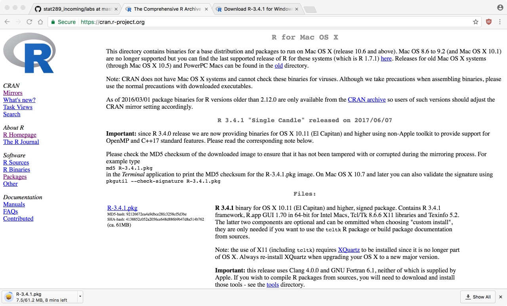
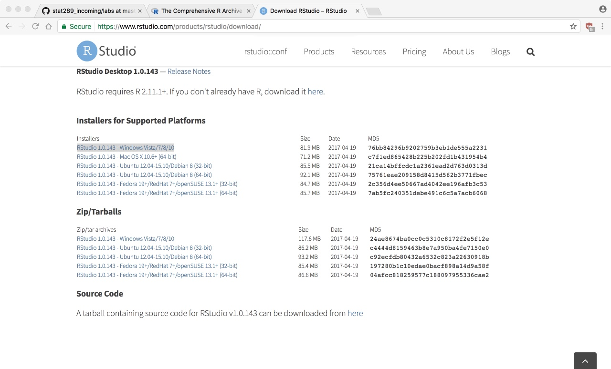

# Setting up R

## Download software

The first step is to download the R programming language. To do
this go to [https://cran.r-project.org/](https://cran.r-project.org/)
and select your platform:

For macOS, just download R-3.5.2 (or whatever is the most recent):

For Windows, first select **base**

And then *Download R 3.5.2*

One you have the .pkg (macOS) or .exe (Windows) file,
install this on your computer according to the default
settings.

## RStudio

The files we just downloaded are the core R language files
doing all the hard work of processing data. Next, we'll
install a helpful GUI frontend that make calling R easier.

Go to [https://www.rstudio.com/](https://www.rstudio.com/).
Click on Products => RStudio.

Scroll down to the **DOWNLOAD RSTUDIO DESKTOP** button
and click on it.

Scroll down again to the **Installers for Supported Platforms**.
The Windows link gives you an exe:

And the macOS link gives a dmg:

Now, install R or RStudio as you would any other program. It
should link automatically to the version of R you just
installed.

